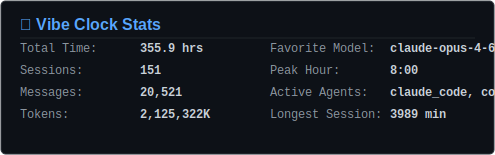
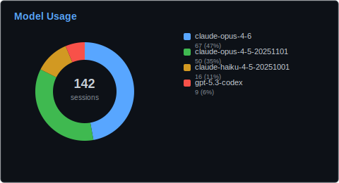
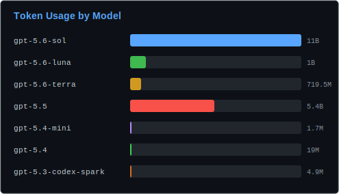
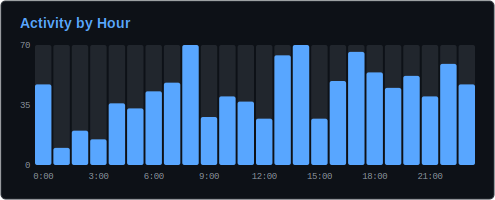
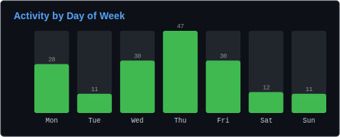

<div align="center">
<h1 align="center">Hi👋 Dex here. Welcome to my page!</h1>
</div>

```rust
const DEX: Profile = Profile {
    role: "Member of Technical Stuff at Weco AI",
    focus: "self-improving agents, harness engineering, context management, eval evolution",
    hobbies: "strength training 🏋️ and surf rock guitar 🎸",
};
```

<p align="center">
  <a href="https://github.com/dexhunter"></a>
  <a href="https://scholar.google.co.jp/citations?user=8Ez_u30AAAAJ&hl=en"></a>
  <a href="https://dex.moe"></a>
  <a href="mailto:i@dex.moe"></a>
</p>

## 📚 Research

- **[AIDE: AI-Driven Exploration in the Space of Code](https://arxiv.org/abs/2502.13138)** - autonomous code and ML engineering exploration, 2025
- **[Lightweight and unobtrusive data obfuscation at IoT edge for remote inference](https://ieeexplore.ieee.org/document/9152178)** - IEEE Internet of Things Journal, 2020
- **[Challenges of privacy-preserving machine learning in IoT](https://dl.acm.org/doi/10.1145/3363347.3363365)** - ACM AIChallengeIoT workshop, 2019
- **[A deep reinforcement learning framework for financial portfolio management](https://arxiv.org/abs/1706.10059)** - early work on reinforcement learning for portfolio management, 2017

## 🎤 Talks

- **[Hands-on AutoResearch: Cracking OpenAI's Parameter Golf](https://yoheinakajima.github.io/aie-talks/)** (2026)
- **[Algorithmic Trading Workshop](https://slides.dex.moe)** (2024)
- **[Deep Learning for Power System Security Assessment](https://slides.dex.moe)** (2019)
- **[Introduction to Hyperledger Fabric](https://slides.dex.moe)** (2019)

## 🏅 Awards

- 🏆 Special Prize (US$10,000), Wanxiang Blockchain Hackathon by QTUM (2018)
- 🥇 1st Prize, EOS Hackathon Hangzhou (team, 2018)
- 🥇 1st Prize, Hack x FDU 2017 Hackathon (out of more than 70 teams)
- 🥈 2nd Prize, XJTLU Blockchain Technology Application Innovation & Entrepreneurship Challenge (2020)
- 🥈 2nd Prize, XJTLU & PNP AI Innovation Hackathon (2018)
- 🥉 3rd Prize, EOS Hackathon Hangzhou (individual, 2018)
- 🥉 3rd Prize, DoraHacks x BCH Faith Hack (2018)
- 🏆 IBM Student Innovation Lab Program Award (2017)
- 🎓 Hyperledger Diversity Scholarship, Hyperledger Global Forum (2020)
- 🎓 CNCF Diversity Scholarship, KubeCon + CloudNativeCon China (2018)

## ⏱ [Vibe Clock](https://github.com/dexhunter/vibe-clock)

<p align="center">
  
</p>
<p align="center">
  
  
</p>
<p align="center">
  
  
</p>
