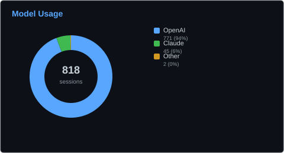
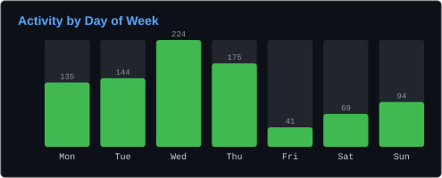

<h1 align="center">Hi👋 Dex here. Welcome to my page!</h1>

  
  
  
  
  
  

## 👨‍💻 About

I'm a Member of Technical Staff at [Weco AI](https://github.com/wecoai), where I build autonomous agents for long-horizon research work — agents that write code, run it against a metric, and keep improving it without supervision. I entered one in [OpenAI's Parameter Golf](https://github.com/openai/parameter-golf) (18 March – 30 April 2026), which drew 2,000+ submissions from 1,000+ participants. Seven of the 46 entries in the official [record-track directory](https://github.com/openai/parameter-golf/tree/main/records/track_10min_16mb) are mine, more than any other participant — the next-best holds two. OpenAI's [retrospective](https://openai.com/index/what-parameter-golf-taught-us/) picked [one of them](https://github.com/openai/parameter-golf/pull/1060) as one of nine record-track submissions it chose to highlight, which OpenAI said "extended earlier quantization work into a stronger compression path".

I co-authored [AIDE](https://arxiv.org/abs/2502.13138), a tree-search agent that writes and improves machine learning code, and I've [contributed](https://github.com/WecoAI/aideml/pulls?q=is%3Apr+author%3Adexhunter+is%3Amerged) to its codebase since 2024. OpenAI's [GPT-4.5 system card](https://cdn.openai.com/gpt-4-5-system-card-2272025.pdf) ran its MLE-bench evaluations of GPT-4.5, o1 and o3-mini "using the AIDE agent", and Meta FAIR's [AI Research Agents](https://arxiv.org/abs/2507.02554) calls AIDE "the state-of-the-art approach" and rebuilds it as the baseline agent it measures against. Separately, I've [contributed](https://github.com/UKGovernmentBEIS/inspect_ai/pulls?q=is%3Apr+author%3Adexhunter+is%3Amerged) to Inspect, the UK AI Security Institute's open-source LLM evaluation framework — including performance work on clustered-stderr scoring and tool-result media extraction.

Before Weco I built trading backends in Rust, Go, and Node.js at [Hex Trust](https://hextrust.com). I'm one of the two current [maintainers](https://github.com/hyperledger/fabric-sdk-py/blob/main/MAINTAINERS.md) of the Hyperledger Fabric Python SDK, a Linux Foundation project. I studied Information and Computing Sciences at the University of Liverpool and Xi'an Jiaotong-Liverpool University, with earlier research at Nanyang Technological University, Zhejiang University, and Hong Kong Baptist University.

## 🌱 Open source

**Featured**

- **[UK AI Security Institute — Inspect](https://github.com/UKGovernmentBEIS/inspect_ai)** — performance work on the UK government's LLM evaluation framework: cut clustered-stderr scoring time and memory ([#4714](https://github.com/UKGovernmentBEIS/inspect_ai/pull/4714)), and made tool-result media extraction linear in conversation length ([#4628](https://github.com/UKGovernmentBEIS/inspect_ai/pull/4628)).
- **[OpenAI Parameter Golf](https://github.com/openai/parameter-golf)** — Aiden, the autonomous research agent I built at Weco, finished as the [#1 contributor](https://www.weco.ai/blog/parameter-golf-aiden): 7 leaderboard records, against a next-best individual human of 3. The best took validation BPB to a 5-seed mean of [1.0645](https://github.com/openai/parameter-golf/pull/1769). Aiden files under my account, so those pull requests appear in the table below.
- **Agent runtimes** — merged performance work into [openclaw](https://github.com/openclaw/openclaw/pull/99714), [AutoGPT](https://github.com/Significant-Gravitas/AutoGPT/pull/13478), [goose](https://github.com/aaif-goose/goose/pull/10409), [qwen-code](https://github.com/QwenLM/qwen-code/pull/8253), [pydantic-ai](https://github.com/pydantic/pydantic-ai/pull/6485), [agno](https://github.com/agno-agi/agno/pull/8907) and [BAML](https://github.com/BoundaryML/baml/pull/3975).
- **AI research infrastructure** — cut redundant AST parsing in Sakana AI's [ShinkaEvolve](https://github.com/SakanaAI/ShinkaEvolve/pull/175) and bounded process-pool shutdown latency in [OpenEvolve](https://github.com/algorithmicsuperintelligence/openevolve/pull/469); smaller docs fixes in Meta's [aira-dojo](https://github.com/facebookresearch/aira-dojo/pull/2), Microsoft's [RD-Agent](https://github.com/microsoft/RD-Agent/pull/1249) and OpenAI's [MLE-bench](https://github.com/openai/mle-bench/pull/101).
- **[AIDE](https://github.com/WecoAI/aideml)** — contributions to the open-source tree-search agent behind my 2025 paper; it writes, evaluates, and improves machine learning code. I also contribute to [weco-cli](https://github.com/WecoAI/weco-cli), the command line tool that drives it.

Every project below links to its merged pull requests on GitHub, so anything here can be checked directly. Ranked by stars, refreshed weekly.

<!-- OSS-PRS:START -->

**Contributions to 52 open source projects — 29 of them AI or agent infrastructure.**

### AI and agent infrastructure

| Project | Stars | Contributions | Latest |
| --- | ---: | --- | --- |
|  [openclaw/openclaw](https://github.com/openclaw/openclaw) | 389k | [View PRs](https://github.com/openclaw/openclaw/pulls?q=is%3Apr+author%3Adexhunter+is%3Amerged) | Jul 2026 |
|  [Significant-Gravitas/AutoGPT](https://github.com/Significant-Gravitas/AutoGPT) | 187k | [View PRs](https://github.com/Significant-Gravitas/AutoGPT/pulls?q=is%3Apr+author%3Adexhunter+is%3Amerged) | Jul 2026 |
|  [langchain-ai/langchain](https://github.com/langchain-ai/langchain) | 146k | [View PRs](https://github.com/langchain-ai/langchain/pulls?q=is%3Apr+author%3Adexhunter+is%3Amerged) | Mar 2024 |
|  [OpenBB-finance/OpenBB](https://github.com/OpenBB-finance/OpenBB) | 73k | [View PRs](https://github.com/OpenBB-finance/OpenBB/pulls?q=is%3Apr+author%3Adexhunter+is%3Amerged) | Jul 2026 |
|  [aaif-goose/goose](https://github.com/aaif-goose/goose) | 54k | [View PRs](https://github.com/aaif-goose/goose/pulls?q=is%3Apr+author%3Adexhunter+is%3Amerged) | Jul 2026 |
|  [agno-agi/agno](https://github.com/agno-agi/agno) | 42k | [View PRs](https://github.com/agno-agi/agno/pulls?q=is%3Apr+author%3Adexhunter+is%3Amerged) | Jul 2026 |
|  [invoke-ai/InvokeAI](https://github.com/invoke-ai/InvokeAI) | 28k | [View PRs](https://github.com/invoke-ai/InvokeAI/pulls?q=is%3Apr+author%3Adexhunter+is%3Amerged) | Aug 2026 |
|  [QwenLM/qwen-code](https://github.com/QwenLM/qwen-code) | 28k | [View PRs](https://github.com/QwenLM/qwen-code/pulls?q=is%3Apr+author%3Adexhunter+is%3Amerged) | Aug 2026 |
|  [pydantic/pydantic-ai](https://github.com/pydantic/pydantic-ai) | 20k | [View PRs](https://github.com/pydantic/pydantic-ai/pulls?q=is%3Apr+author%3Adexhunter+is%3Amerged) | Jul 2026 |
|  [lllyasviel/style2paints](https://github.com/lllyasviel/style2paints) | 18k | [View PRs](https://github.com/lllyasviel/style2paints/pulls?q=is%3Apr+author%3Adexhunter+is%3Amerged) | Aug 2017 |
|  [pipecat-ai/pipecat](https://github.com/pipecat-ai/pipecat) | 15k | [View PRs](https://github.com/pipecat-ai/pipecat/pulls?q=is%3Apr+author%3Adexhunter+is%3Amerged) | Jul 2026 |
|  [microsoft/RD-Agent](https://github.com/microsoft/RD-Agent) | 14k | [View PRs](https://github.com/microsoft/RD-Agent/pulls?q=is%3Apr+author%3Adexhunter+is%3Amerged) | Sep 2025 |
|  [tadata-org/fastapi_mcp](https://github.com/tadata-org/fastapi_mcp) | 12k | [View PRs](https://github.com/tadata-org/fastapi_mcp/pulls?q=is%3Apr+author%3Adexhunter+is%3Amerged) | Mar 2025 |
|  [phillipi/pix2pix](https://github.com/phillipi/pix2pix) | 11k | [View PRs](https://github.com/phillipi/pix2pix/pulls?q=is%3Apr+author%3Adexhunter+is%3Amerged) | Jun 2017 |
|  [BoundaryML/baml](https://github.com/BoundaryML/baml) | 9.1k | [View PRs](https://github.com/BoundaryML/baml/pulls?q=is%3Apr+author%3Adexhunter+is%3Amerged) | Aug 2026 |
|  [algorithmicsuperintelligence/openevolve](https://github.com/algorithmicsuperintelligence/openevolve) | 7.3k | [View PRs](https://github.com/algorithmicsuperintelligence/openevolve/pulls?q=is%3Apr+author%3Adexhunter+is%3Amerged) | Jul 2026 |
|  [openai/parameter-golf](https://github.com/openai/parameter-golf) | 5.2k | [View PRs](https://github.com/openai/parameter-golf/pulls?q=is%3Apr+author%3Adexhunter+is%3Amerged) | Apr 2026 |
|  [TanStack/ai](https://github.com/TanStack/ai) | 3.1k | [View PRs](https://github.com/TanStack/ai/pulls?q=is%3Apr+author%3Adexhunter+is%3Amerged) | Aug 2026 |
|  [UKGovernmentBEIS/inspect_ai](https://github.com/UKGovernmentBEIS/inspect_ai) | 2.7k | [View PRs](https://github.com/UKGovernmentBEIS/inspect_ai/pulls?q=is%3Apr+author%3Adexhunter+is%3Amerged) | Aug 2026 |
|  [ZhengyaoJiang/PGPortfolio](https://github.com/ZhengyaoJiang/PGPortfolio) | 1.9k | [View PRs](https://github.com/ZhengyaoJiang/PGPortfolio/pulls?q=is%3Apr+author%3Adexhunter+is%3Amerged) | Dec 2017 |

9 more AI projects

| Project | Stars | Contributions | Latest |
| --- | ---: | --- | --- |
|  [openai/mle-bench](https://github.com/openai/mle-bench) | 1.7k | [View PRs](https://github.com/openai/mle-bench/pulls?q=is%3Apr+author%3Adexhunter+is%3Amerged) | Nov 2025 |
|  [Farama-Foundation/ChatArena](https://github.com/Farama-Foundation/ChatArena) | 1.6k | [View PRs](https://github.com/Farama-Foundation/ChatArena/pulls?q=is%3Apr+author%3Adexhunter+is%3Amerged) | Jun 2023 |
|  [WecoAI/aideml](https://github.com/WecoAI/aideml) | 1.5k | [View PRs](https://github.com/WecoAI/aideml/pulls?q=is%3Apr+author%3Adexhunter+is%3Amerged) | Jul 2026 |
|  [SakanaAI/ShinkaEvolve](https://github.com/SakanaAI/ShinkaEvolve) | 1.4k | [View PRs](https://github.com/SakanaAI/ShinkaEvolve/pulls?q=is%3Apr+author%3Adexhunter+is%3Amerged) | Aug 2026 |
|  [tongjingqi/AI-Can-Learn-Scientific-Taste](https://github.com/tongjingqi/AI-Can-Learn-Scientific-Taste) | 432 | [View PRs](https://github.com/tongjingqi/AI-Can-Learn-Scientific-Taste/pulls?q=is%3Apr+author%3Adexhunter+is%3Amerged) | Mar 2026 |
|  [facebookresearch/aira-dojo](https://github.com/facebookresearch/aira-dojo) | 165 | [View PRs](https://github.com/facebookresearch/aira-dojo/pulls?q=is%3Apr+author%3Adexhunter+is%3Amerged) | Jul 2025 |
|  [WecoAI/weco-cli](https://github.com/WecoAI/weco-cli) | 94 | [View PRs](https://github.com/WecoAI/weco-cli/pulls?q=is%3Apr+author%3Adexhunter+is%3Amerged) | Sep 2025 |
|  [JeanKaddour/sokoban_speedrun](https://github.com/JeanKaddour/sokoban_speedrun) | 31 | [View PRs](https://github.com/JeanKaddour/sokoban_speedrun/pulls?q=is%3Apr+author%3Adexhunter+is%3Amerged) | Jul 2026 |
|  [openbydesign/lush](https://github.com/openbydesign/lush) | 3 | [View PRs](https://github.com/openbydesign/lush/pulls?q=is%3Apr+author%3Adexhunter+is%3Amerged) | Aug 2026 |

23 projects outside AI

| Project | Stars | Contributions | Latest |
| --- | ---: | --- | --- |
|  [remotion-dev/remotion](https://github.com/remotion-dev/remotion) | 58k | [View PRs](https://github.com/remotion-dev/remotion/pulls?q=is%3Apr+author%3Adexhunter+is%3Amerged) | Aug 2026 |
|  [ManimCommunity/manim](https://github.com/ManimCommunity/manim) | 41k | [View PRs](https://github.com/ManimCommunity/manim/pulls?q=is%3Apr+author%3Adexhunter+is%3Amerged) | Aug 2026 |
|  [python-poetry/poetry](https://github.com/python-poetry/poetry) | 34k | [View PRs](https://github.com/python-poetry/poetry/pulls?q=is%3Apr+author%3Adexhunter+is%3Amerged) | Aug 2026 |
|  [mementum/backtrader](https://github.com/mementum/backtrader) | 23k | [View PRs](https://github.com/mementum/backtrader/pulls?q=is%3Apr+author%3Adexhunter+is%3Amerged) | Aug 2017 |
|  [MSWorkers/support.996.ICU](https://github.com/MSWorkers/support.996.ICU) | 10k | [View PRs](https://github.com/MSWorkers/support.996.ICU/pulls?q=is%3Apr+author%3Adexhunter+is%3Amerged) | Apr 2019 |
|  [yeasy/blockchain_guide](https://github.com/yeasy/blockchain_guide) | 7.1k | [View PRs](https://github.com/yeasy/blockchain_guide/pulls?q=is%3Apr+author%3Adexhunter+is%3Amerged) | Mar 2019 |
|  [kubernetes/website](https://github.com/kubernetes/website) | 5.4k | [View PRs](https://github.com/kubernetes/website/pulls?q=is%3Apr+author%3Adexhunter+is%3Amerged) | Apr 2020 |
|  [ReactiveX/RxPY](https://github.com/ReactiveX/RxPY) | 5.0k | [View PRs](https://github.com/ReactiveX/RxPY/pulls?q=is%3Apr+author%3Adexhunter+is%3Amerged) | Sep 2018 |
|  [mikedh/trimesh](https://github.com/mikedh/trimesh) | 3.7k | [View PRs](https://github.com/mikedh/trimesh/pulls?q=is%3Apr+author%3Adexhunter+is%3Amerged) | Aug 2026 |
|  [yihong0618/GitHubPoster](https://github.com/yihong0618/GitHubPoster) | 1.9k | [View PRs](https://github.com/yihong0618/GitHubPoster/pulls?q=is%3Apr+author%3Adexhunter+is%3Amerged) | Jun 2021 |
|  [TA-Lib/ta-lib](https://github.com/TA-Lib/ta-lib) | 1.7k | [View PRs](https://github.com/TA-Lib/ta-lib/pulls?q=is%3Apr+author%3Adexhunter+is%3Amerged) | Aug 2026 |
|  [tuna/blogroll](https://github.com/tuna/blogroll) | 952 | [View PRs](https://github.com/tuna/blogroll/pulls?q=is%3Apr+author%3Adexhunter+is%3Amerged) | Feb 2020 |
|  [hyperledger-cello/cello](https://github.com/hyperledger-cello/cello) | 918 | [View PRs](https://github.com/hyperledger-cello/cello/pulls?q=is%3Apr+author%3Adexhunter+is%3Amerged) | Jun 2021 |
|  [Marigold/universal-portfolios](https://github.com/Marigold/universal-portfolios) | 858 | [View PRs](https://github.com/Marigold/universal-portfolios/pulls?q=is%3Apr+author%3Adexhunter+is%3Amerged) | Nov 2019 |
|  [joelparkerhenderson/demo-rust-axum](https://github.com/joelparkerhenderson/demo-rust-axum) | 442 | [View PRs](https://github.com/joelparkerhenderson/demo-rust-axum/pulls?q=is%3Apr+author%3Adexhunter+is%3Amerged) | May 2022 |
|  [hyperledger/fabric-sdk-py](https://github.com/hyperledger/fabric-sdk-py) | 416 | [View PRs](https://github.com/hyperledger/fabric-sdk-py/pulls?q=is%3Apr+author%3Adexhunter+is%3Amerged) | May 2021 |
|  [dimpurr/awesome-acg-machine-learning](https://github.com/dimpurr/awesome-acg-machine-learning) | 120 | [View PRs](https://github.com/dimpurr/awesome-acg-machine-learning/pulls?q=is%3Apr+author%3Adexhunter+is%3Amerged) | Oct 2018 |
|  [skyzh/skyzh-site](https://github.com/skyzh/skyzh-site) | 24 | [View PRs](https://github.com/skyzh/skyzh-site/pulls?q=is%3Apr+author%3Adexhunter+is%3Amerged) | Jul 2021 |
|  [awesome-xjtlu/wiki](https://github.com/awesome-xjtlu/wiki) | 16 | [View PRs](https://github.com/awesome-xjtlu/wiki/pulls?q=is%3Apr+author%3Adexhunter+is%3Amerged) | Jun 2021 |
|  [IntensiveCoLearning/Ethereum-Protocol-Fellowship-3](https://github.com/IntensiveCoLearning/Ethereum-Protocol-Fellowship-3) | 10 | [View PRs](https://github.com/IntensiveCoLearning/Ethereum-Protocol-Fellowship-3/pulls?q=is%3Apr+author%3Adexhunter+is%3Amerged) | Mar 2025 |
|  [IntensiveCoLearning/ai-agent](https://github.com/IntensiveCoLearning/ai-agent) | 8 | [View PRs](https://github.com/IntensiveCoLearning/ai-agent/pulls?q=is%3Apr+author%3Adexhunter+is%3Amerged) | May 2025 |
|  [xieyuheng/awesome-why](https://github.com/xieyuheng/awesome-why) | 1 | [View PRs](https://github.com/xieyuheng/awesome-why/pulls?q=is%3Apr+author%3Adexhunter+is%3Amerged) | Jul 2019 |
|  [IntensiveCoLearning/running](https://github.com/IntensiveCoLearning/running) | 0 | [View PRs](https://github.com/IntensiveCoLearning/running/pulls?q=is%3Apr+author%3Adexhunter+is%3Amerged) | May 2025 |

<!-- OSS-PRS:END -->

## 📚 Publications

- *AIDE: AI-Driven Exploration in the Space of Code* ([arXiv](https://arxiv.org/abs/2502.13138)), arXiv preprint, 2025
- *Lightweight and Unobtrusive Data Obfuscation at IoT Edge for Remote Inference* ([DOI](https://doi.org/10.1109/JIOT.2020.2983278)), IEEE Internet of Things Journal, 2020
- *Challenges of Privacy-Preserving Machine Learning in IoT* ([DOI](https://doi.org/10.1145/3363347.3363357)), ACM AIChallengeIoT, 2019
- *A Deep Reinforcement Learning Framework for the Financial Portfolio Management Problem* ([arXiv](https://arxiv.org/abs/1706.10059)), arXiv preprint, 2017

Citation counts are on [Google Scholar](https://scholar.google.co.jp/citations?user=8Ez_u30AAAAJ&hl=en).

## 🎤 Talks

- **Hands-on AutoResearch: Cracking OpenAI's Parameter Golf** — workshop with the Weco AI team, [AI Engineer World's Fair 2026](https://www.ai.engineer/worldsfair/2026/schedule)
- **[Algorithmic Trading Workshop](https://slides.dex.moe)** (2024)
- **[Deep Learning for Power System Security Assessment](https://slides.dex.moe)** (2019)
- **[Introduction to Hyperledger Fabric](https://slides.dex.moe)** (2019)

## 🏅 Awards

- 🏆 Special Prize (US$10,000), Wanxiang Blockchain Hackathon by QTUM (2018)
- 🥇 1st Prize, EOS Hackathon Hangzhou (team, 2018)
- 🥇 1st Prize, Hack x FDU 2017 Hackathon (out of more than 70 teams)
- 🥈 2nd Prize, XJTLU Blockchain Technology Application Innovation & Entrepreneurship Challenge (2020)
- 🥈 2nd Prize, XJTLU & PNP AI Innovation Hackathon (2018)
- 🥉 3rd Prize, EOS Hackathon Hangzhou (individual, 2018)
- 🥉 3rd Prize, DoraHacks x BCH Faith Hack (2018)
- 🏆 IBM Student Innovation Lab Program Award (2017)
- 🎓 Hyperledger Diversity Scholarship, Hyperledger Global Forum (2020)
- 🎓 CNCF Diversity Scholarship, KubeCon + CloudNativeCon China (2018)

## ⏱ [Vibe Clock](https://github.com/dexhunter/vibe-clock)

An open-source tool I built: WakaTime-style usage tracking for Claude Code, Codex, and OpenCode. The charts below are my own usage, refreshed daily.

  

  
  

  
  

